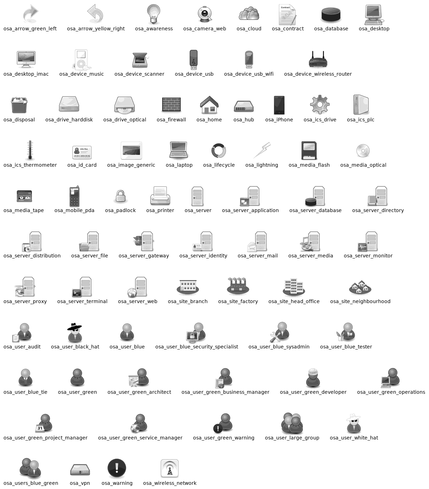

---
export_on_save:
  html: true
---
# C4 CHEATSHEET

```
Themes: 
!include https://raw.githubusercontent.com/patrik-csak/one-dark-plantuml-theme/v1.0.1/theme.puml
!theme cb_seq_YlOrBr_9 from https://raw.githubusercontent.com/mweagle/C4-PlantUML-Themes/main/palettes

Sprites: https://crashedmind.github.io/PlantUMLHitchhikersGuide/NetworkUsersMachines/NetworkUsersMachines.html#view-all-the-icons-with-listsprites

!define osaPuml https://raw.githubusercontent.com/Crashedmind/PlantUML-opensecurityarchitecture2-icons/master
!include osaPuml/Common.puml
!include osaPuml/User/all.puml
!include osaPuml/Hardware/all.puml
!include osaPuml/Misc/all.puml
!include osaPuml/Server/all.puml
!include osaPuml/Site/all.puml

!include https://raw.githubusercontent.com/plantuml-stdlib/C4-PlantUML/master/C4_Container.puml
Container:
    Container(alias, label, ?techn, ?descr, ?$sprite, ?tags, ?link)
    ContainerDb
    ContainerQueue
    Container_Ext
    ContainerDb_Ext
    ContainerQueue_Ext
    Container_Boundary(alias, label, ?tags, ?link)

!include https://raw.githubusercontent.com/plantuml-stdlib/C4-PlantUML/master/C4_Context.puml
System: 
    Person(alias, label, ?descr, ?$sprite, ?tags, ?link, ?type)
    Person_Ext
    System(alias, label, ?descr, ?$sprite, ?tags, ?link, ?type)
    SystemDb
    SystemQueue
    System_Ext
    SystemDb_Ext
    SystemQueue_Ext
    Boundary(alias, label, ?type, ?tags, ?link)
    Enterprise_Boundary(alias, label, ?tags, ?link)
    System_Boundary
    sprite: person, person2, robot, robot2

!include https://raw.githubusercontent.com/plantuml-stdlib/C4-PlantUML/master/C4_Component.puml
Component
    Component(alias, label, ?techn, ?descr, ?$sprite, ?tags, ?link)
    ComponentDb
    ComponentQueue
    Component_Ext
    ComponentDb_Ext
    ComponentQueue_Ext

!include https://raw.githubusercontent.com/plantuml-stdlib/C4-PlantUML/master/C4_Deployment.puml
Deployment:
    Deployment_Node(alias, label, ?type, ?descr, ?$sprite, ?tags, ?link)
    Node(alias, label, ?type, ?descr, ?$sprite, ?tags, ?link): short name of Deployment_Node()
    Node_L(alias, label, ?type, ?descr, ?$sprite, ?tags, ?link): left aligned Node()
    Node_R(alias, label, ?type, ?descr, ?$sprite, ?tags, ?link): right aligned Node()
    AddProperty(label, descr)
```

```
Rel(node1, node2, "Uses", "HTTPS")
LAYOUT_WITH_LEGEND()
SHOW_LEGEND()
```



# SEQUENCE CHEATSHEET
```
Entities:
    participant     a rectangle
    actor           a person
    database
    entity          M(model)
    control         C(controller)
    collection
    queue
    boundary
```

```
participant "User A" as a <<Interface>>
participant "User B" as b <<Interface>>
a -> b: call
return result
```

```
->              autoactivate on
-> message !!   delete target
-> message **   create target
-> message ++   activate target

== ==           comment in link
```

```
group #LightBlue/LightPink if condition [comment]
end
```

```
loop 1000 times
end
```

```
note left of
note right of 
note over
```

# Markdown configuration
```
https://hub.docker.com/r/plantuml/plantuml-server/

# settings.json
"plantuml.server": "http://localhost:8080/svg",
"plantuml.render": "PlantUMLServer",
"markdown-preview-enhanced.plantumlServer": "http://localhost:8080/svg",
"markdown-preview-enhanced.scrollSync": false,
"markdown-preview-enhanced.previewMode": "Previews Only",
"workbench.editorAssociations": {
}, # add this to override vscode default
"plantuml.jarArgs": [
 "-DRELATIVE_INCLUDE=."
 ],

# diagram.md
---
export_on_save:
  html: true
---
!include <C4/C4_Deployment>
!include <C4/C4_Context>
!include <C4/C4_Container>
!include <C4/C4_Component>
```
