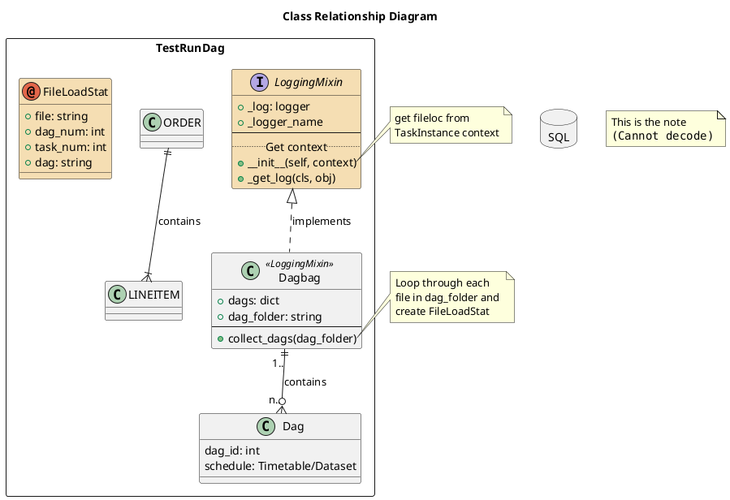

```plantuml
@startuml

title Class Relationship Diagram

namespace TestRunDag<<Rectangle>> {
    LoggingMixin <|.. Dagbag: implements
    Dagbag "1.." ||--o{ "n.." Dag: contains
    ORDER ||--|{ LINEITEM : contains

    annotation FileLoadStat #Wheat {
        + file: string
        + dag_num: int
        + task_num: int
        + dag: string
    }

    interface LoggingMixin #Wheat {
        + _log: logger
        + _logger_name
        --
        .. Get context ..
        + __init__(self, context)
        + _get_log(cls, obj)
    }
    class Dagbag<<LoggingMixin>> {
        + dags: dict 
        + dag_folder: string
        --
        + collect_dags(dag_folder)
    }

    class Dag {
        dag_id: int
        schedule: Timetable/Dataset
    }
}

namespace SQL<<Database>> {

}

note right of LoggingMixin::__init__
    get fileloc from
    TaskInstance context
end note

note right of Dagbag::collect_dags
    Loop through each 
    file in dag_folder and 
    create FileLoadStat
end note

note as N1
    This is the note
    <img src="airflow.png">
end note

@enduml
```