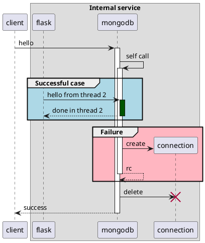

---
export_on_save:
    html: true
---

```plantuml

@startuml
autoactivate on
client -> mongodb : hello
mongodb -> mongodb : self call
box "Internal service"
    participant flask
    participant mongodb
    participant connection
    group #LightBlue Successful case
        flask -> mongodb #005500 : hello from thread 2
        return done in thread 2
    end
    group #LightPink Failure
        mongodb -> connection ** : create
        return rc
    end
end box
mongodb -> connection !! : delete
return success

@enduml

```