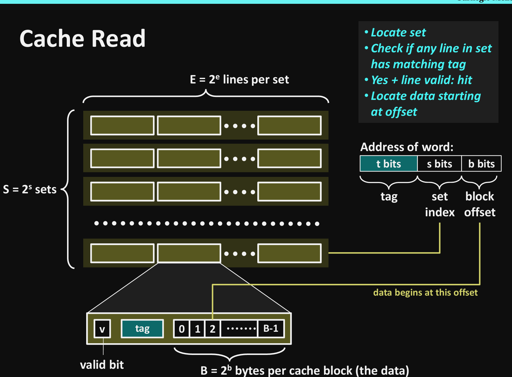
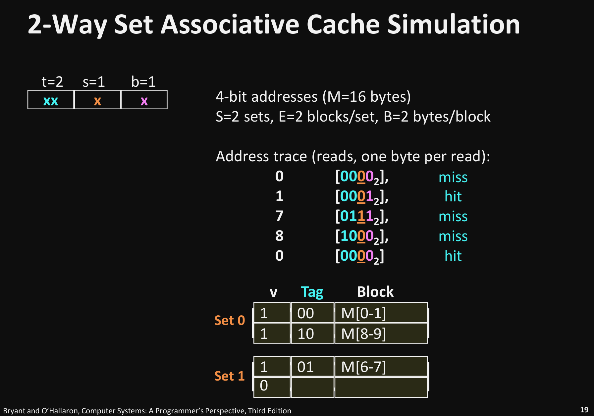
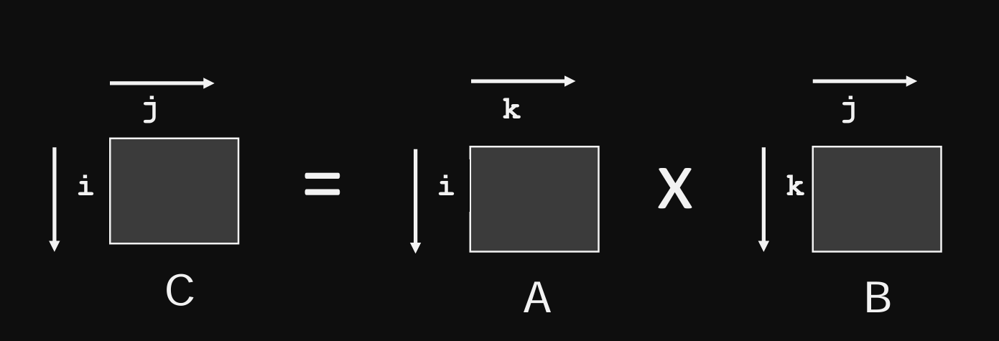
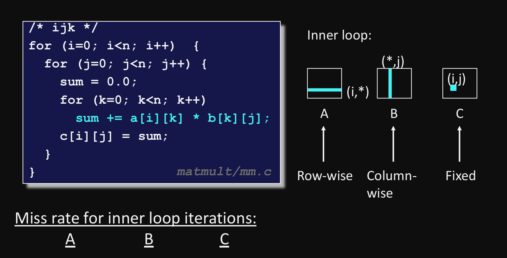
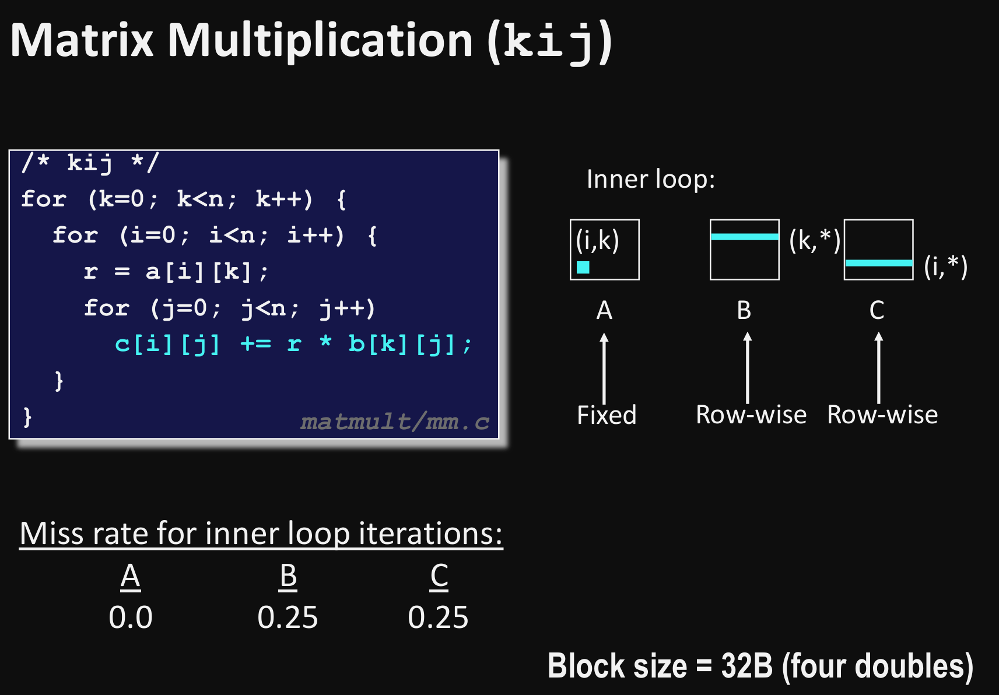

# ***Definitions***
## General
L1, L2, L3 -> SRAM -> same packet as CPU
L4 DRAM -> main memory
L5 local disk
L6 remote secondary storage
1. Cache mapping
Cache == n Sets = n Blocks
2. Addressing scheme
4 sets
2 blocks
-> 2-way set-associative cache
Refer block 0 and 8 will result in conflict miss everytim
## Types of cache miss
cold miss
capacity miss
conflict miss
# ***Cache organization***
Cache size = S.E.B
S = 2^s sets
E = 2^e lines
line = {valid bit | tag | 0 1 2...B-1}
                            2^b bytes
1. Address of word:
t bits | s bits | b bits

2. If cache miss -> old *line is replaced

3. High bit indexing vs middle bit indexing
TT|SS|BB        0000xx -> set 0
                0001xx -> set 1
SS|TT|BB        0000xx -> set 0
                0001xx -> set 0
# ***Cache Writes***
1. Types
write-through + no-write-allocate
    write immediately to mem
write-back + write-allocate
    defer write to mem until replacement
    load into cache + update cache line
2. Examples
 A write to address X is issued
    If it is a hit
        Update the contents of block
        Set dirty bit to 1 (bit is sticky and only cleared on eviction)
    If miss and dirty bit is set to 0
        Fetch block from memory (per a read miss)
        The perform the write operations (per a write hit)
    If miss and dirty bit is set to 1
        The entire block of 2b bytes are written back to memory
        Dirty bit is cleared (set to 0)
        Line is replaced by new contents
# ***Performance***
cache hit time of 1 cycle
miss penalty of 100 cycle
    97% hits:  1 cycle + 0.03 x 100 cycles = 4 cycles
    99% hits:  1 cycle + 0.01 x 100 cycles = 2 cycles

# ***Memory Slope increases***
## Matrix multiplication
### Problem Description

### Cache miss analysis
Best case

## Block matrix multiplication
### Cache miss analysis

# References
https://www.cs.cmu.edu/afs/cs/academic/class/15213-f21/www/lectures/10-cache-memories.pdf