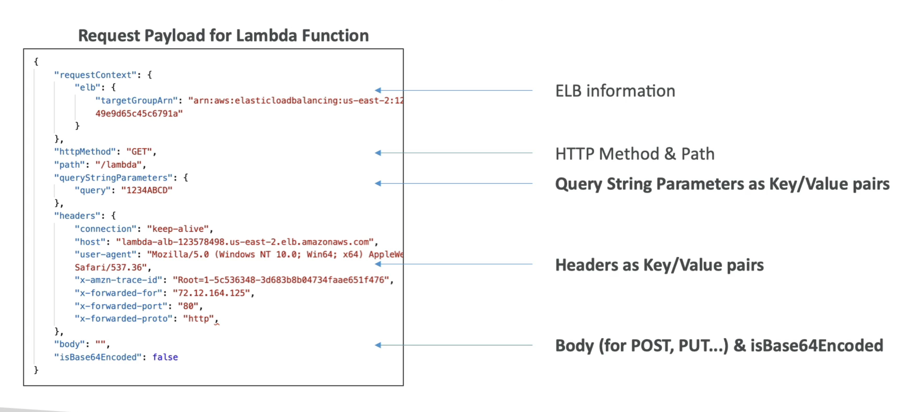
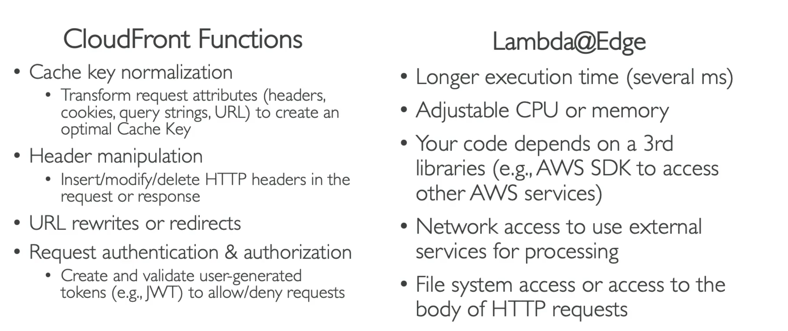
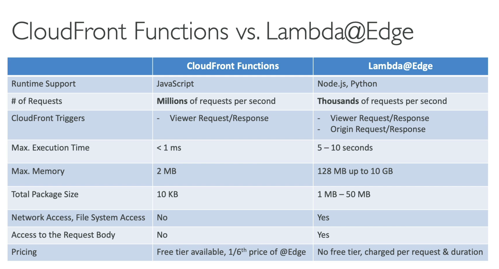
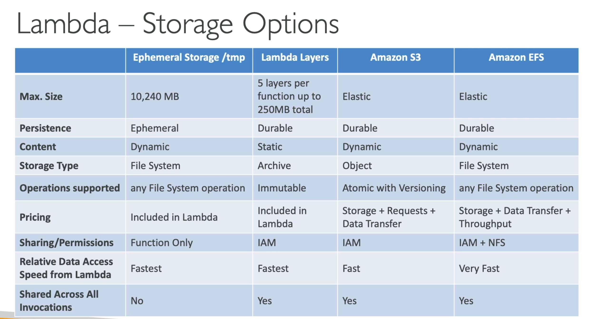
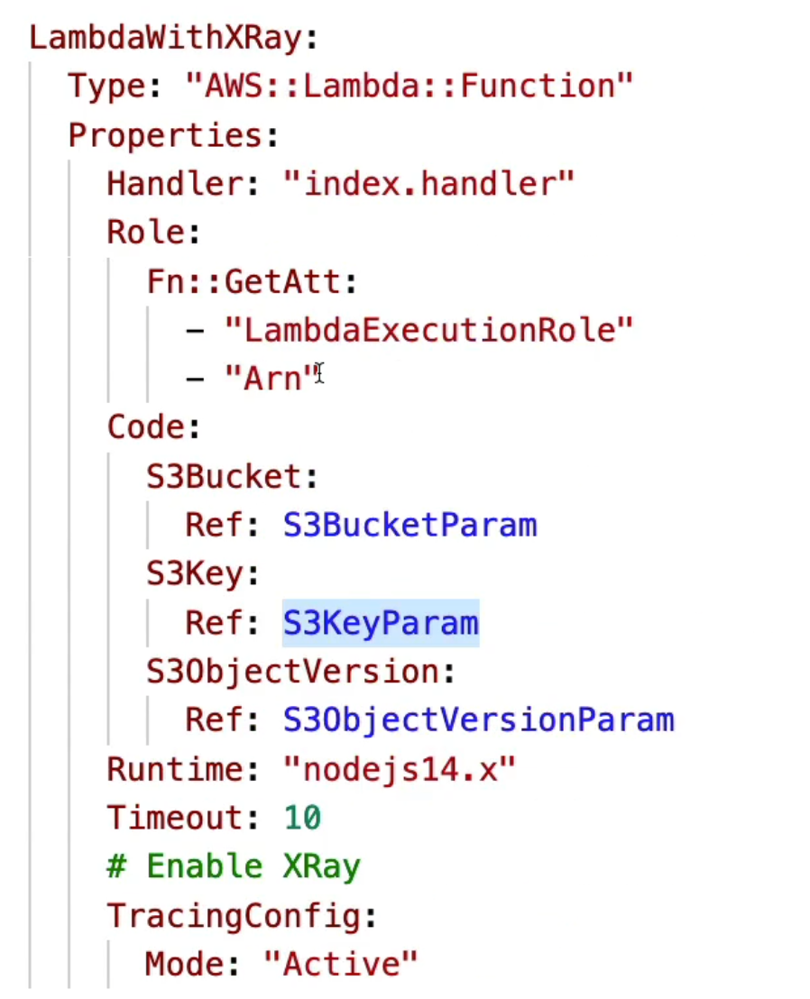

# ***Lambda function***
## Definitions
- Pricing
First 1.000.000 requests are free
$0.20 per 1.000.000 requests after

Error handling at client side (retries, exp backoff)

- Synchronous invocations
User invoked:
    Application load balancer (ALB)
        Expose lambda function as an HTTPS endpoint
        - Request: ELB info, method & path
        
    Amazon API Gateway
    Amazon CloudFront
    Amazon S3 Batch
Service invoked:
    Amazon Cognito
    AWS step functions
    
- Asynchronous invocations
    S3, SQS, Cloudwatch events
    - Events are placed at event queue
    - Make sure that requests are idempotent
    - DLQ (dead-letter queue) and SQS for failed processing

- Event source mapping
    Kinesis & DynamoDB
    - Shards -> Stream poller ----> batches -> invokers -> lambda functions
                        consistent hashing
    - upto 10 batches per shared processed simultaneously
    SQS batch ---> lambda (event source mapping) -> lambda functions
    - upto 1000 batches of messages processed simultaneously

- Security
Execution roles
    AWSLambdaBasicExecutionRole -> upload logs to Cloudwatch
    AWSLambdaSQSQueueExecutionRole -> read from SQS (lambda trigger)
    AWSLambdaVPCAccessExecutionRole -> deploy lambda functions in VPC

- An unique url endpoint is created for each lambda function
    https://<url_id>.lambda-url.<region>.on.aws

AWS S3 Ingest
Functions, Trigger, Event, Runtime
## Life cycle
init phase
    Extension init
    Runtime init
    Function init
invoke phase
## Cloudfront vs LambdaEdge

## Lambda in VPC
Lambda function -> ENI (elastic network interface) -> RDS Security Group
aws vpc                                               private rds

Lambda fucntion -> NAT gateway -> IGW -> public internet
aws vpc            public subnet

Lambda fucntion -> VPC Endpoint -> public internet
aws vpc            private subnet
## Lambda file system mounting
/tmp
lambda layers
amazon S3
EFS

## Concurrency
1000 concurrent executions
Throttle behavior
    synchronous -> ThrottleError 429
    asynchronous -> retry -> DLQ
## Lambda + Cloudformation
Create new S3 instance + store lambda function as file
    S3BucketParam
    S3KeyParam (lambda function)
    These configurations are inside yaml
Create new template
 
## Lambda Container images
build from base image that implements lambda run time API
## Lambda versions
1. types
lambda version == code + configurations
    work on $LATEST
    publish verson
    versions weight (50%-50% mean 2 requests, 1 to ver 1, 1 to ver 2)
alias == pointers to lambda versions
2. CodeDeploy
Migration 10% new version, 90% previous version
Linear
    10% every 3 min
Canary
    10% for 30 min then 100%
AllAtONce
    100% new version
3. yaml
name
    name of lambda function
alias
    alias of lambda function
CurrentVersion
TargetVersion
## Security
AWS_IAM
Same account
    Identity based policy OR Resource based policy
Cross account
    Identity based policy AND Resource based policy
# ***Lambda Examples***
## API Gateway + Lambda
https://docs.aws.amazon.com/lambda/latest/dg/services-apigateway-tutorial.html

Lambda functions
    Create policy on DB:
        lambda-apigateway-policy
        Resource *
        Action allow
    Create execution role: 
        lambda-apigateway-role
    Create function:
        connect to db using aws-sdks
        export default handler function
    Zip function: zip function.zip index.mjs
    Create lambda function:
        aws lambda create-function
        - function name
        - zip file
        - handler
        - runtime (python, nodejs)
        - lambda-apigateway-role
API Gateway
    Create method POST /api
    Create integration: Lambda
Connect DynamoDB
    Choose DynamoDBManager in API Gateway console
Deploy

## API Gateway + RDS
RDS supports Microsoft SQL Server, MariaDB, MySQL, Oracle Database, and PostgreSQL
DB Instance
    Engine + admin/pass
Lambda function
    connect using RDS proxy: db admin/pass
Execution role
    AWSLambdaSQSQueueExecutionRole
    AWSLambdaVPCAccessExecutionRole
Deployment Package
    mkdir package
    pip install --target package
    cd package ; zip -r ../lambda_function.zip .
    cd .. ; zip lambda_function.zip lambda_function.py
SQS
    message_id
    md5 of payload
    receipt_handle: to delete received message
    - If receives same message 5 times -> send it to Dead letter queue (DLQ)
Event source mapping
    trigger lambda function for batch of messages in SQS

## Ecommerce CRUD
client -> api gateway REST -> product microservices -> product table
                                                  aws sdk
Infrastructure creation on AWS
Develop lambda microservices CRUD
RestAPI logic with AWS SDK

## Infra
### Setup
#### DynamoDB
Create table
    table name      product
    partition key   id
#### Lambda
Create funcion
    function name   productFunction
    runtime         nodejs 16
    arch            x86_64
Create permissions
    create role     Simple microservice permissions (DynamoDB)
#### Environment variables
DYNAMODB_TABLE_NAME product
PRIMARY_KEY         id
### API Gateway
#### Design
Resource:
    resource name       product
    resource path       /product
Method:
    Root name
        product
    and under this name, we have GET and POST methods
        // GET /product
        // POST /product
    and we have single product with id parameters
        product.addResource('{id}');
        // GET /product/{id}
        // PUT /product/{id}
        // DELETE /product/{id}
Deploy /prod/product
#### Cloudwatch

# ***API Gateway***
