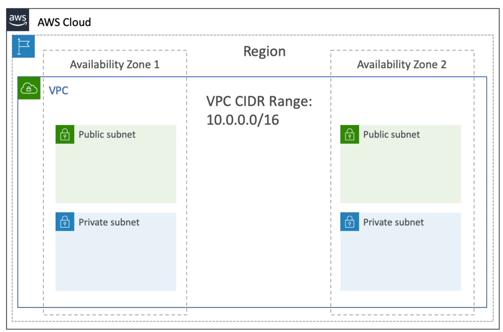
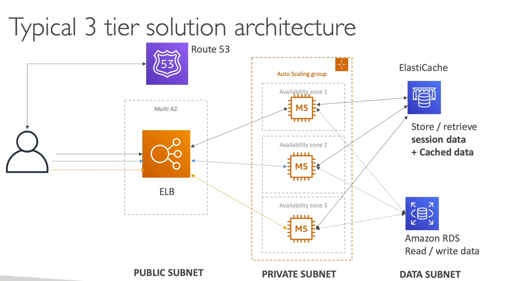

# ***Definitions***

Subnet
    tied to AZ
Route table
    provide access internet between subnets
Internet gateway
    VPC level: helps public subnet connect internet
NAT gateway
    private subnet -> internet
Network ACL
    attach at subnet level
    allow/deny rules
Security Groups
    attach to EC2 instance
    allow rules only
VPC Peering
    connect VPC
VPC Endpoint Gateway
    private network -> S3, DynamoDB
VPC Endpoint Interface
    private network -> other AWS services
Site-Site-VPN
    On premises DB -> VPN -> VPC
Direct Connect
    On premises DB -> VPC
    took a month to establish
# ***3-tier architecture***

# ***VPC***
1. subnets associated with AZ (availabily zone)
2. EC2 and RDS are deployed within AZ
3. Internet gateway
    within <-> external internet
4. NAT
    within -> external internet