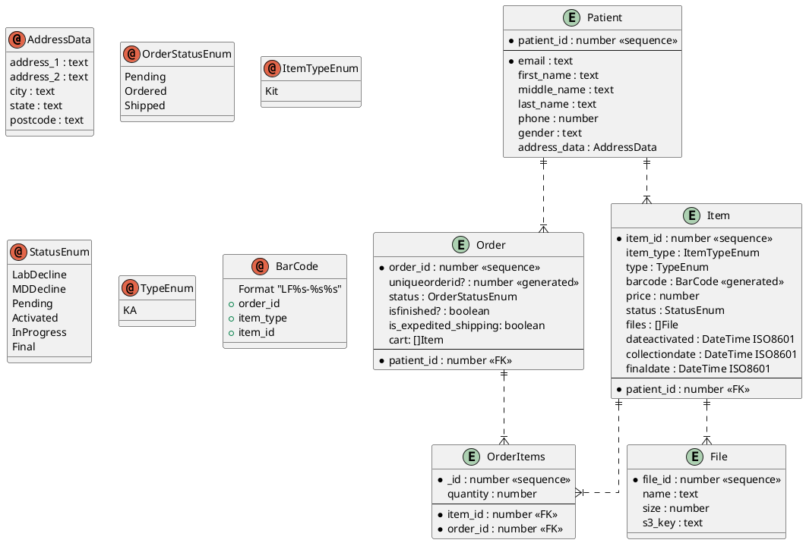

---
export_on_save:
  html: true
---

Access Patterns                         Key conditions                  Filter condition
GET patient data
GET(paging)kits by barcode
                by status
                by order_id
                by patient_id
                between start_date&end_date 

Order
    cart
        +code
        +quantity
        +purchase_price

