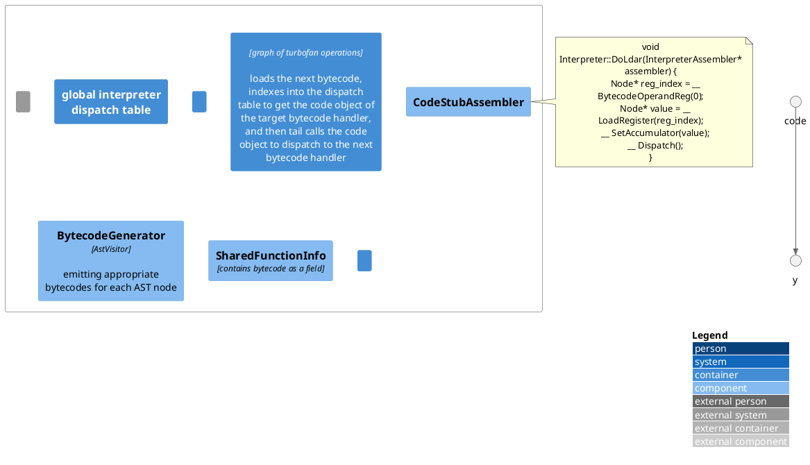
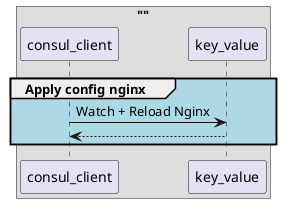

---
export_on_save:
  html: true
---

```plantuml
@startuml
!include <C4/C4_Deployment>
!include <C4/C4_Context>
!include <C4/C4_Container>
!include <C4/C4_Component>
skinparam linetype polyline
LAYOUT_WITH_LEGEND()

Deployment_Node(c, "", ""){
    System_Ext(b, ""){

    }
    Container(global_dispatch_table, "global interpreter dispatch table", "", "")
    Container(code_pointer, "", "", "")
    Container(bytecode_handler, "", "graph of turbofan operations", "loads the next bytecode, indexes into the dispatch table to get the code object of the target bytecode handler, and then tail calls the code object to dispatch to the next bytecode handler")
    Component(assembler, "CodeStubAssembler", "", "")
    Component(code_generator, "BytecodeGenerator", "AstVisitor", "emitting appropriate bytecodes for each AST node")
    Component(shared_function_info, "SharedFunctionInfo", "contains bytecode as a field", "")
    Component(ignition, "InterpreterEntryTrampoline", "setup stackframe", "start first execution of the function in the interpreter")
    Container(ignition, "", "", "")
    Container(ignition, "", "", "")
    Container(ignition, "", "", "")
    Container(ignition, "", "", "")
    Container(ignition, "", "", "")
}

Rel(code,y , "")

note right of assembler
    void Interpreter::DoLdar(InterpreterAssembler* assembler) {
        Node* reg_index = __ BytecodeOperandReg(0);
        Node* value = __ LoadRegister(reg_index);
        __ SetAccumulator(value);
        __ Dispatch();
    }
end note

@enduml
```

```plantuml
@startuml
box ""
    group #LightBlue Apply config nginx
        consul_client -> key_value: Watch + Reload Nginx
        return
    end
end box

@enduml
```