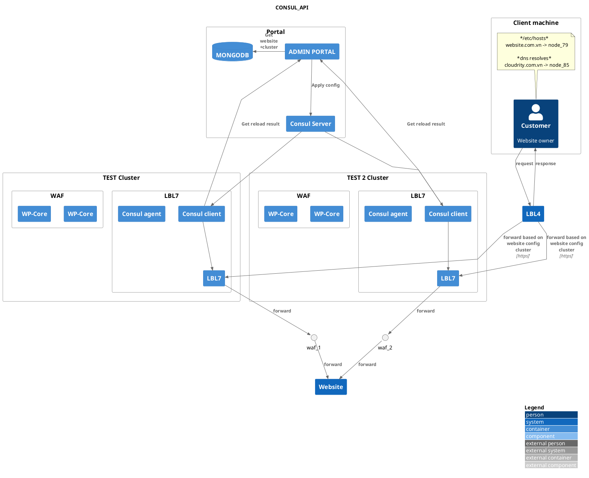
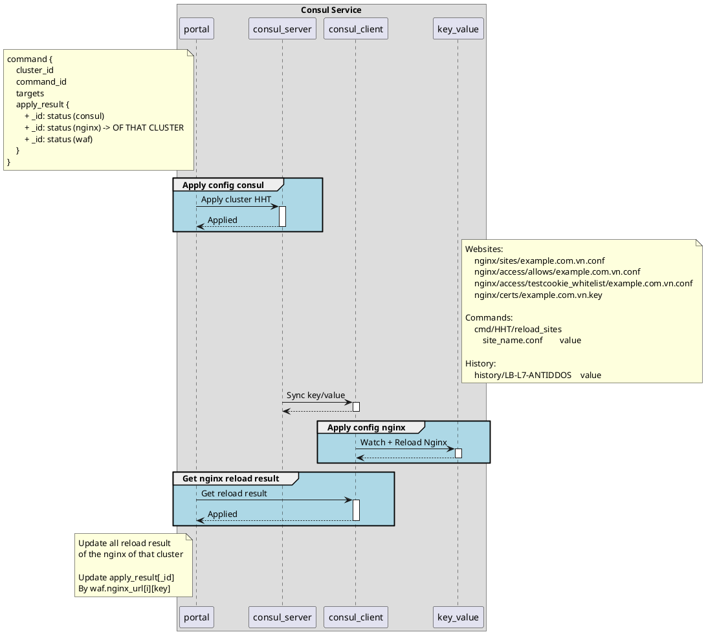

---
export_on_save:
  html: true
---

```plantuml
@startuml
!include <C4/C4_Deployment>
!include <C4/C4_Context>
!include <C4/C4_Container>
!include <C4/C4_Component>
LAYOUT_WITH_LEGEND()
skinparam linetype polyline

title CONSUL_API

Deployment_Node(node_84, "Client machine") {
    Person(customer, Customer, "Website owner")
    note top of customer
        */etc/hosts*
            website.com.vn -> node_79

        *dns resolves*
            cloudrity.com.vn -> node_85
    end note
}

System(lbl4, "LBL4")

Deployment_Node(node_78, "Portal"){
    Container(admin_portal, "ADMIN PORTAL", "", "")
    ContainerDb(mongodb, "MONGODB", "", "")
    Container(consul_server, "Consul Server", "","")
}

Deployment_Node(TEST, "TEST Cluster"){
    Deployment_Node(node_79, "LBL7"){
        Container(consul_client_1, "Consul client", "")
        Container(consul_agent_1, "Consul agent", "","")
        Container(lbl7_1, "LBL7", "", "")
    }
    
    Deployment_Node(node_85, "WAF"){
        Container(core_1, "WP-Core", "", "")
        Container(core_2, "WP-Core", "", "")
    }
}

Deployment_Node(TEST_2, "TEST 2 Cluster") {
    Deployment_Node(node_82, "LBL7"){
        Container(consul_client_2, "Consul client", "")
        Container(consul_agent_2, "Consul agent", "","")
        Container(lbl7_2, "LBL7", "", "")
    }

    Deployment_Node(node_96, "WAF"){
        Container(core_3, "WP-Core", "", "")
        Container(core_4, "WP-Core", "", "")
    }
}

System(website, "Website")

Rel(customer, lbl4, "request")
Rel_Back(customer, lbl4, "response")
Rel(lbl4, lbl7_1, "forward based on website config\ncluster", "https")'
Rel(lbl4, lbl7_2, "forward based on website config\ncluster", "https")'

Rel(admin_portal, consul_server, "Apply config")
Rel_Back(admin_portal, consul_client_1, "Get reload result")
Rel_Back(admin_portal, consul_client_2, "Get reload result")
Rel_Back_Neighbor(mongodb, admin_portal, "Get\nwebsite\n+cluster")

Rel(lbl7_1, waf_1, "forward")
Rel(lbl7_2, waf_2, "forward")
Rel(waf_1, website, "forward")
Rel(waf_2, website, "forward")

Rel(consul_server, consul_client_1, "")
Rel(consul_server, consul_client_2, "")

Rel(consul_client_1, lbl7_1, "")
Rel(consul_client_2, lbl7_2, "")

@enduml
```

```plantuml

@startuml
autoactivate on


' client -> mongodb : hello
' mongodb -> mongodb : self call
box "Consul Service"
    participant portal
    participant consul_server
    participant consul_client
    participant key_value

    note left of portal
        command {
            cluster_id
            command_id
            targets
            apply_result {
                + _id: status (consul)
                + _id: status (nginx) -> OF THAT CLUSTER
                + _id: status (waf)
            }
        }
    end note
    group #LightBlue Apply config consul
        portal -> consul_server: Apply cluster HHT
        return Applied
    end
   
    note right of key_value
        Websites:
            nginx/sites/example.com.vn.conf
            nginx/access/allows/example.com.vn.conf
            nginx/access/testcookie_whitelist/example.com.vn.conf
            nginx/certs/example.com.vn.key

        Commands:        
            cmd/HHT/reload_sites
                site_name.conf        value

        History:
            history/LB-L7-ANTIDDOS    value
    end note
    consul_server -> consul_client: Sync key/value
    return

    group #LightBlue Apply config nginx
        consul_client -> key_value: Watch + Reload Nginx
        return
    end

    group #LightBlue Get nginx reload result
        portal -> consul_client: Get reload result
        return Applied
    end
    note left of portal
        Update all reload result
        of the nginx of that cluster

        Update apply_result[_id]
        By waf.nginx_url[i][key]
    end note
end box

   

@enduml

```
