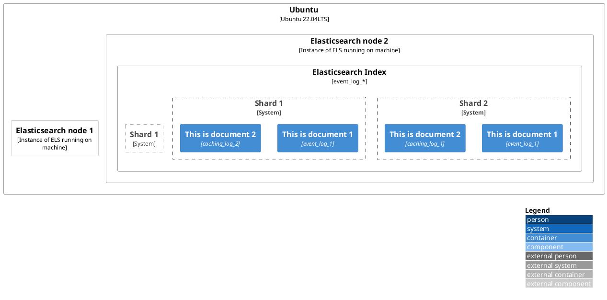

---
export_on_save:
  html: true
---

GOAL: els query 10.000 -> 100.000 documents in < 3s

OVERVIEW
    total 1128938 documents
    165 shards, each index 1 shard

Baseline:

    final_index = int(body['from'] / body['size'])
    page_number = 0
    
    initial_search = self.es.search
    scroll_id = initial_search.get('_scroll_id')
    
    while page_number < final_index:
        page = self.es.scroll(scroll_id=scroll_id, scroll='1m')
        scroll_id = page.get('_scroll_id')
        page_number += 12

Using search_after:
+ sort by _id, uptime:

        1. query get 10000 elements: Took 18s. Take _id, timestamp
        2. query next 10000 elements using query_after _id, timestamp: Took: 31s.
Using scroll api:
+ sort by uptime:

        1. query first 10000 elements: Took 0.8s (220 kB). Take scroll_id.
        GET /index*/_search?scroll=1m
        1. query next 10000 elements using scroll_id. Took 0.6s.
        POST /_search/scroll                                                               
        {
            "scroll": 1m,
            "scroll_id": ""
        }

Additional parameters:

query_then_fetch:
- Description: This is the default search type in Elasticsearch. It consists of two phases: the query phase and the fetch phase.
- Workflow:
    Query Phase: The query is sent to all relevant shards in parallel, and each shard produces a set of matching documents.
    Fetch Phase: The results from each shard are fetched and combined, and the final result set is returned to the client.
    
query_and_fetch:
- Description: Similar to query_then_fetch, but it performs the query phase and fetch phase sequentially for each shard.
- Workflow:
    Query Phase: The query is sent to one shard at a time, and the matching documents are retrieved.
    Fetch Phase: After the query phase is completed for one shard, the fetch phase is performed to retrieve the results.

dfs_query_then_fetch:
- Description: Stands for "distributed first, then query and fetch." It is designed for more accurate scoring when using the distributed term frequencies of the entire index.
- Workflow:
    Distributed Term Frequency Phase: The query is first distributed to all shards to collect global term frequencies.
    Query Phase: The query is then sent to all shards in parallel, and each shard produces a set of matching documents.
    Fetch Phase: The results from each shard are fetched and combined, and the final result set is returned to the client.

dfs_query_and_fetch:
- Description: Similar to dfs_query_then_fetch, but it performs the query phase and fetch phase sequentially for each shard.
- Workflow:
    Distributed Term Frequency Phase: The query is first distributed to all shards to collect global term frequencies.
    Query Phase: The query is then sent to one shard at a time, and the matching documents are retrieved.
    Fetch Phase: After the query phase is completed for one shard, the fetch phase is performed to retrieve the results.
